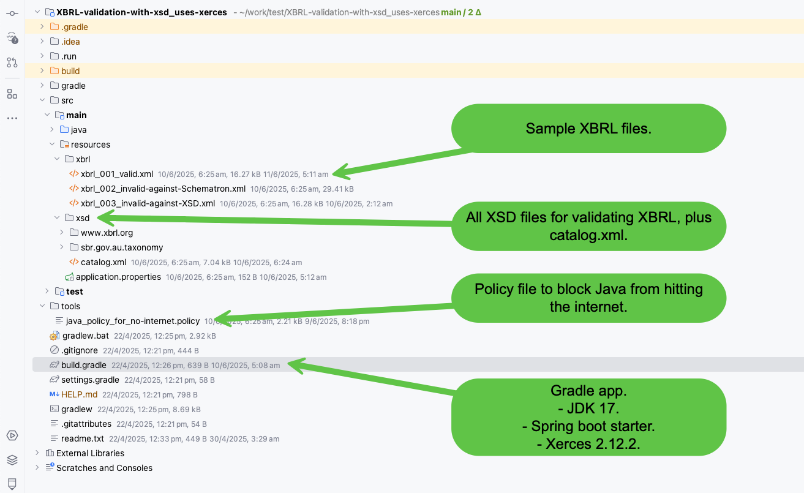

Slide 1 - project layout.

The project is on GitHub: https://github.com/robertmarkbram/XbrlValidationWithXsdUsesXercesApplication

1. Sample [XBRL files](https://github.com/robertmarkbram/XbrlValidationWithXsdUsesXercesApplication/tree/main/src/main/resources/xbrl).
2. All [XSD files](https://github.com/robertmarkbram/XbrlValidationWithXsdUsesXercesApplication/tree/main/src/main/resources/xsd) for validation XBRL, plus the [catalog.xml](https://github.com/robertmarkbram/XbrlValidationWithXsdUsesXercesApplication/blob/main/src/main/resources/xsd/catalog.xml).
3. [Policy file](https://github.com/robertmarkbram/XbrlValidationWithXsdUsesXercesApplication/blob/main/tools/java_policy_for_no-internet.policy) to block Java from reaching the internet.
4. [build.gradle](https://github.com/robertmarkbram/XbrlValidationWithXsdUsesXercesApplication/blob/main/build.gradle).
