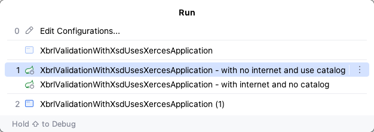

<p id="top">Slide 2 - run the app.</p>

Run the main class, [XbrlValidationWithXsdUsesXercesApplication.java](https://github.com/robertmarkbram/XbrlValidationWithXsdUsesXercesApplication/blob/main/src/main/java/com/example/XBRL_validation_with_xsd_uses_xerces/XbrlValidationWithXsdUsesXercesApplication.java), using one of two options.



1. With internet and without [the catalog](https://github.com/robertmarkbram/XbrlValidationWithXsdUsesXercesApplication/blob/main/src/main/resources/xsd/catalog.xml).

    <details>
      <summary>Click to view logging from with internet and no catalog.</summary>

    ``` {title="Logging from with internet and no catalog",wrap="false"}
    2025-06-30T11:14:15.354+10:00  INFO 53825 --- [XBRL-validation-with-xsd_uses-xerces] [           main] rlValidationWithXsdUsesXercesApplication : Running with internet and without the catalog.
    2025-06-30T11:14:15.354+10:00  INFO 53825 --- [XBRL-validation-with-xsd_uses-xerces] [           main] rlValidationWithXsdUsesXercesApplication : ========== src/main/resources/xbrl/xbrl_001_valid.xml ==========
    2025-06-30T11:14:17.907+10:00  INFO 53825 --- [XBRL-validation-with-xsd_uses-xerces] [           main] rlValidationWithXsdUsesXercesApplication : 'src/main/resources/xbrl/xbrl_001_valid.xml' is valid against 'src/main/resources/xsd/sbr.gov.au/taxonomy/sbr_au_reports/sprstrm/sprcnt/sprcnt_0001/sprcnt.0001.conttrans.request.02.02.report.xsd'.
    2025-06-30T11:14:17.907+10:00  INFO 53825 --- [XBRL-validation-with-xsd_uses-xerces] [           main] rlValidationWithXsdUsesXercesApplication : ========== src/main/resources/xbrl/xbrl_002_invalid-against-Schematron.xml ==========
    2025-06-30T11:14:19.422+10:00 ERROR 53825 --- [XBRL-validation-with-xsd_uses-xerces] [           main] rlValidationWithXsdUsesXercesApplication : Error: org.xml.sax.SAXParseException; systemId: file:/Users/rob.bram/work/test/XBRL-validation-with-xsd_uses-xerces/src/main/resources/xbrl/xbrl_002_invalid-against-Schematron.xml; lineNumber: 26; columnNumber: 45; cvc-complex-type.2.4.b: The content of element 'orgname1.02.00:OrganisationNameDetails' is not complete. One of '{"http://sbr.gov.au/icls/py/pyde/pyde.02.00.data":OrganisationNameDetails.OrganisationalName.Text}' is expected.
    2025-06-30T11:14:19.422+10:00 ERROR 53825 --- [XBRL-validation-with-xsd_uses-xerces] [           main] rlValidationWithXsdUsesXercesApplication : Error: org.xml.sax.SAXParseException; systemId: file:/Users/rob.bram/work/test/XBRL-validation-with-xsd_uses-xerces/src/main/resources/xbrl/xbrl_002_invalid-against-Schematron.xml; lineNumber: 178; columnNumber: 25; cvc-complex-type.2.4.a: Invalid content was found starting with element '{"http://www.xbrl.org/2003/instance":segment}'. One of '{"http://www.xbrl.org/2003/instance":identifier}' is expected.
    2025-06-30T11:14:19.422+10:00  INFO 53825 --- [XBRL-validation-with-xsd_uses-xerces] [           main] rlValidationWithXsdUsesXercesApplication : ========== src/main/resources/xbrl/xbrl_003_invalid-against-XSD.xml ==========
    2025-06-30T11:14:20.827+10:00 ERROR 53825 --- [XBRL-validation-with-xsd_uses-xerces] [           main] rlValidationWithXsdUsesXercesApplication : Error: org.xml.sax.SAXParseException; systemId: file:/Users/rob.bram/work/test/XBRL-validation-with-xsd_uses-xerces/src/main/resources/xbrl/xbrl_003_invalid-against-XSD.xml; lineNumber: 47; columnNumber: 159; cvc-pattern-valid: Value '日本人中國的' is not facet-valid with respect to pattern '[0-9]{6}' for type '#AnonType_sbrBankServiceBranchCodeItemType'.
    2025-06-30T11:14:20.827+10:00 ERROR 53825 --- [XBRL-validation-with-xsd_uses-xerces] [           main] rlValidationWithXsdUsesXercesApplication : Error: org.xml.sax.SAXParseException; systemId: file:/Users/rob.bram/work/test/XBRL-validation-with-xsd_uses-xerces/src/main/resources/xbrl/xbrl_003_invalid-against-XSD.xml; lineNumber: 47; columnNumber: 159; cvc-complex-type.2.2: Element 'pyid.02.00:FinancialInstitutionAccount.BankStateBranch.Number' must have no element [children], and the value must be valid.
    ```

    1. `xbrl_001_valid.xml` is valid.
    2. `xbrl_002_invalid-against-Schematron.xml` has two errors

        ```
        lineNumber: 26; columnNumber: 45; cvc-complex-type.2.4.b: The content of element 'orgname1.02.00:OrganisationNameDetails' is not complete. One of '{"http://sbr.gov.au/icls/py/pyde/pyde.02.00.data":OrganisationNameDetails.OrganisationalName.Text}' is expected.
        lineNumber: 178; columnNumber: 25; cvc-complex-type.2.4.a: Invalid content was found starting with element '{"http://www.xbrl.org/2003/instance":segment}'. One of '{"http://www.xbrl.org/2003/instance":identifier}' is expected.
        ```

    3. `xbrl_003_invalid-against-XSD.xml` has two errors

        ```
        lineNumber: 47; columnNumber: 159; cvc-pattern-valid: Value '日本人中國的' is not facet-valid with respect to pattern '[0-9]{6}' for type '#AnonType_sbrBankServiceBranchCodeItemType'.
        lineNumber: 47; columnNumber: 159; cvc-complex-type.2.2: Element 'pyid.02.00:FinancialInstitutionAccount.BankStateBranch.Number' must have no element [children], and the value must be valid.
        ```

    </details>

2. Without internet and using [the catalog](https://github.com/robertmarkbram/XbrlValidationWithXsdUsesXercesApplication/blob/main/src/main/resources/xsd/catalog.xml).
    1. Forces the application to use the catalog to access the local cache of XSD files.


    <details>
      <summary>Click to view logging from without internet and using the catalog.</summary>

    ``` {title="Logging from with internet and no catalog",wrap="false"}
    2025-06-30T11:19:27.938+10:00  INFO 54600 --- [XBRL-validation-with-xsd_uses-xerces] [           main] rlValidationWithXsdUsesXercesApplication : Running without internet and with the catalog.
    2025-06-30T11:19:27.938+10:00  INFO 54600 --- [XBRL-validation-with-xsd_uses-xerces] [           main] rlValidationWithXsdUsesXercesApplication : ========== src/main/resources/xbrl/xbrl_001_valid.xml ==========
    2025-06-30T11:19:28.225+10:00 ERROR 54600 --- [XBRL-validation-with-xsd_uses-xerces] [           main] rlValidationWithXsdUsesXercesApplication : Error: org.xml.sax.SAXParseException; systemId: file:/Users/rob.bram/work/test/XBRL-validation-with-xsd_uses-xerces/src/main/resources/xbrl/xbrl_001_valid.xml; lineNumber: 46; columnNumber: 51; cvc-complex-type.2.4.a: Invalid content was found starting with element '{"http://sbr.gov.au/comnmdle/comnmdle.financialinstitutionaccount1.02.00.module":FinancialInstitutionAccount}'. One of '{"http://www.xbrl.org/2003/linkbase":schemaRef, "http://www.xbrl.org/2003/linkbase":linkbaseRef, "http://www.xbrl.org/2003/linkbase":roleRef, "http://www.xbrl.org/2003/linkbase":arcroleRef, "http://www.xbrl.org/2003/instance":item, "http://www.xbrl.org/2003/instance":tuple, "http://www.xbrl.org/2003/instance":context, "http://www.xbrl.org/2003/instance":unit, "http://www.xbrl.org/2003/linkbase":footnoteLink}' is expected.
    2025-06-30T11:19:28.225+10:00  INFO 54600 --- [XBRL-validation-with-xsd_uses-xerces] [           main] rlValidationWithXsdUsesXercesApplication : ========== src/main/resources/xbrl/xbrl_002_invalid-against-Schematron.xml ==========
    2025-06-30T11:19:28.284+10:00 ERROR 54600 --- [XBRL-validation-with-xsd_uses-xerces] [           main] rlValidationWithXsdUsesXercesApplication : Error: org.xml.sax.SAXParseException; systemId: file:/Users/rob.bram/work/test/XBRL-validation-with-xsd_uses-xerces/src/main/resources/xbrl/xbrl_002_invalid-against-Schematron.xml; lineNumber: 4; columnNumber: 51; cvc-complex-type.2.4.a: Invalid content was found starting with element '{"http://sbr.gov.au/comnmdle/comnmdle.financialinstitutionaccount1.02.00.module":FinancialInstitutionAccount}'. One of '{"http://www.xbrl.org/2003/linkbase":schemaRef, "http://www.xbrl.org/2003/linkbase":linkbaseRef, "http://www.xbrl.org/2003/linkbase":roleRef, "http://www.xbrl.org/2003/linkbase":arcroleRef, "http://www.xbrl.org/2003/instance":item, "http://www.xbrl.org/2003/instance":tuple, "http://www.xbrl.org/2003/instance":context, "http://www.xbrl.org/2003/instance":unit, "http://www.xbrl.org/2003/linkbase":footnoteLink}' is expected.
    2025-06-30T11:19:28.284+10:00 ERROR 54600 --- [XBRL-validation-with-xsd_uses-xerces] [           main] rlValidationWithXsdUsesXercesApplication : Error: org.xml.sax.SAXParseException; systemId: file:/Users/rob.bram/work/test/XBRL-validation-with-xsd_uses-xerces/src/main/resources/xbrl/xbrl_002_invalid-against-Schematron.xml; lineNumber: 178; columnNumber: 25; cvc-complex-type.2.4.a: Invalid content was found starting with element '{"http://www.xbrl.org/2003/instance":segment}'. One of '{"http://www.xbrl.org/2003/instance":identifier}' is expected.
    2025-06-30T11:19:28.284+10:00  INFO 54600 --- [XBRL-validation-with-xsd_uses-xerces] [           main] rlValidationWithXsdUsesXercesApplication : ========== src/main/resources/xbrl/xbrl_003_invalid-against-XSD.xml ==========
    2025-06-30T11:19:28.346+10:00 ERROR 54600 --- [XBRL-validation-with-xsd_uses-xerces] [           main] rlValidationWithXsdUsesXercesApplication : Error: org.xml.sax.SAXParseException; systemId: file:/Users/rob.bram/work/test/XBRL-validation-with-xsd_uses-xerces/src/main/resources/xbrl/xbrl_003_invalid-against-XSD.xml; lineNumber: 46; columnNumber: 51; cvc-complex-type.2.4.a: Invalid content was found starting with element '{"http://sbr.gov.au/comnmdle/comnmdle.financialinstitutionaccount1.02.00.module":FinancialInstitutionAccount}'. One of '{"http://www.xbrl.org/2003/linkbase":schemaRef, "http://www.xbrl.org/2003/linkbase":linkbaseRef, "http://www.xbrl.org/2003/linkbase":roleRef, "http://www.xbrl.org/2003/linkbase":arcroleRef, "http://www.xbrl.org/2003/instance":item, "http://www.xbrl.org/2003/instance":tuple, "http://www.xbrl.org/2003/instance":context, "http://www.xbrl.org/2003/instance":unit, "http://www.xbrl.org/2003/linkbase":footnoteLink}' is expected.
    2025-06-30T11:19:28.346+10:00 ERROR 54600 --- [XBRL-validation-with-xsd_uses-xerces] [           main] rlValidationWithXsdUsesXercesApplication : Error: org.xml.sax.SAXParseException; systemId: file:/Users/rob.bram/work/test/XBRL-validation-with-xsd_uses-xerces/src/main/resources/xbrl/xbrl_003_invalid-against-XSD.xml; lineNumber: 47; columnNumber: 159; cvc-pattern-valid: Value '日本人中國的' is not facet-valid with respect to pattern '[0-9]{6}' for type '#AnonType_sbrBankServiceBranchCodeItemType'.
    2025-06-30T11:19:28.346+10:00 ERROR 54600 --- [XBRL-validation-with-xsd_uses-xerces] [           main] rlValidationWithXsdUsesXercesApplication : Error: org.xml.sax.SAXParseException; systemId: file:/Users/rob.bram/work/test/XBRL-validation-with-xsd_uses-xerces/src/main/resources/xbrl/xbrl_003_invalid-against-XSD.xml; lineNumber: 47; columnNumber: 159; cvc-complex-type.2.2: Element 'pyid.02.00:FinancialInstitutionAccount.BankStateBranch.Number' must have no element [children], and the value must be valid.
    ```

    1. `xbrl_001_valid.xml` has one error.

        ```
        lineNumber: 46; columnNumber: 51; cvc-complex-type.2.4.a: Invalid content was found starting with element '{"http://sbr.gov.au/comnmdle/comnmdle.financialinstitutionaccount1.02.00.module":FinancialInstitutionAccount}'. One of '{"http://www.xbrl.org/2003/linkbase":schemaRef, "http://www.xbrl.org/2003/linkbase":linkbaseRef, "http://www.xbrl.org/2003/linkbase":roleRef, "http://www.xbrl.org/2003/linkbase":arcroleRef, "http://www.xbrl.org/2003/instance":item, "http://www.xbrl.org/2003/instance":tuple, "http://www.xbrl.org/2003/instance":context, "http://www.xbrl.org/2003/instance":unit, "http://www.xbrl.org/2003/linkbase":footnoteLink}' is expected.
        ```

    2. `xbrl_002_invalid-against-Schematron.xml` has two errors

        ```
        lineNumber: 4; columnNumber: 51; cvc-complex-type.2.4.a: Invalid content was found starting with element '{"http://sbr.gov.au/comnmdle/comnmdle.financialinstitutionaccount1.02.00.module":FinancialInstitutionAccount}'. One of '{"http://www.xbrl.org/2003/linkbase":schemaRef, "http://www.xbrl.org/2003/linkbase":linkbaseRef, "http://www.xbrl.org/2003/linkbase":roleRef, "http://www.xbrl.org/2003/linkbase":arcroleRef, "http://www.xbrl.org/2003/instance":item, "http://www.xbrl.org/2003/instance":tuple, "http://www.xbrl.org/2003/instance":context, "http://www.xbrl.org/2003/instance":unit, "http://www.xbrl.org/2003/linkbase":footnoteLink}' is expected.
        lineNumber: 178; columnNumber: 25; cvc-complex-type.2.4.a: Invalid content was found starting with element '{"http://www.xbrl.org/2003/instance":segment}'. One of '{"http://www.xbrl.org/2003/instance":identifier}' is expected.
        ```

    3. `xbrl_003_invalid-against-XSD.xml` has two errors

        ```
        lineNumber: 46; columnNumber: 51; cvc-complex-type.2.4.a: Invalid content was found starting with element '{"http://sbr.gov.au/comnmdle/comnmdle.financialinstitutionaccount1.02.00.module":FinancialInstitutionAccount}'. One of '{"http://www.xbrl.org/2003/linkbase":schemaRef, "http://www.xbrl.org/2003/linkbase":linkbaseRef, "http://www.xbrl.org/2003/linkbase":roleRef, "http://www.xbrl.org/2003/linkbase":arcroleRef, "http://www.xbrl.org/2003/instance":item, "http://www.xbrl.org/2003/instance":tuple, "http://www.xbrl.org/2003/instance":context, "http://www.xbrl.org/2003/instance":unit, "http://www.xbrl.org/2003/linkbase":footnoteLink}' is expected.
        lineNumber: 47; columnNumber: 159; cvc-pattern-valid: Value '日本人中國的' is not facet-valid with respect to pattern '[0-9]{6}' for type '#AnonType_sbrBankServiceBranchCodeItemType'.
        lineNumber: 47; columnNumber: 159; cvc-complex-type.2.2: Element 'pyid.02.00:FinancialInstitutionAccount.BankStateBranch.Number' must have no element [children], and the value must be valid.
        ```

    </details>
